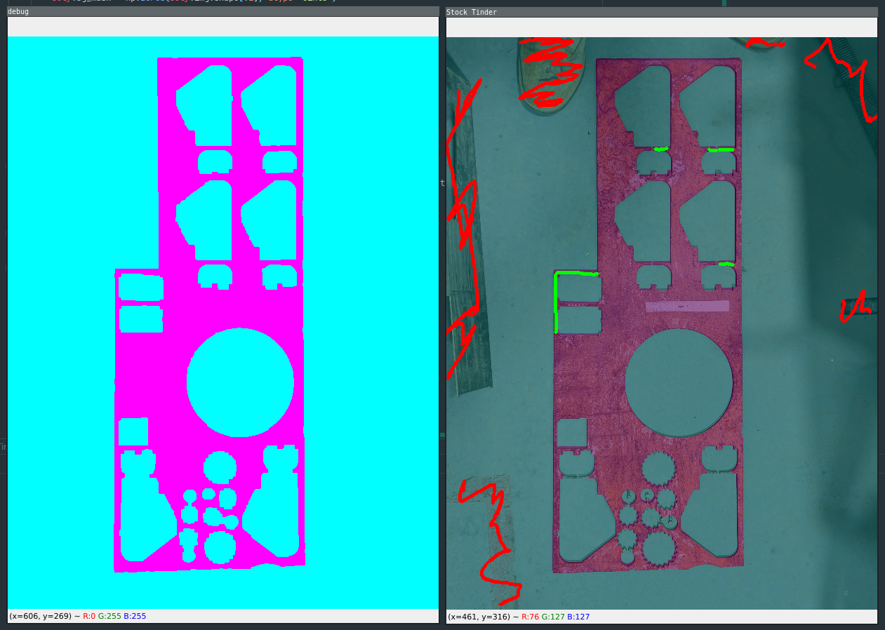

# Stock Tinder
Like Tinder but for matching machinists to pieces of scrap in their shop. Right now it can segment stock from the
background. I think I want to eventually make this a Fusion360 plugin so you can quickly layout parts on a weird piece
of stock by just taking a picture of it.

This is a HEAVY WIP (this is basically just the segmentation proof of concept so far). It seems to work alright for the
included sample images.
 
### Controls
You can correct the mask manually by drawing with your cursor. You really only need to scribble over a part you like or
don't like -- it'll get the idea.

`f`oreground mode

`b`ackground mode

`s`egment

## Project roadmap:
| **Task**                 | **Status**       |
|--------------------------|------------------|
| Segmentation             | Proof of concept |
| Perspective correction   | Not started      |
| UI/Fusion360 integration | Not started      |
| Automatic layout         | Not started      |
| Part/stock database      | Not started      |